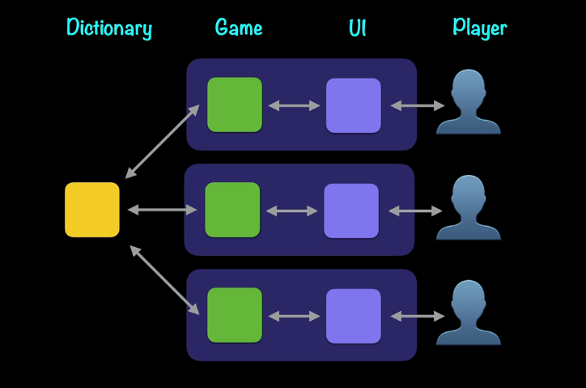
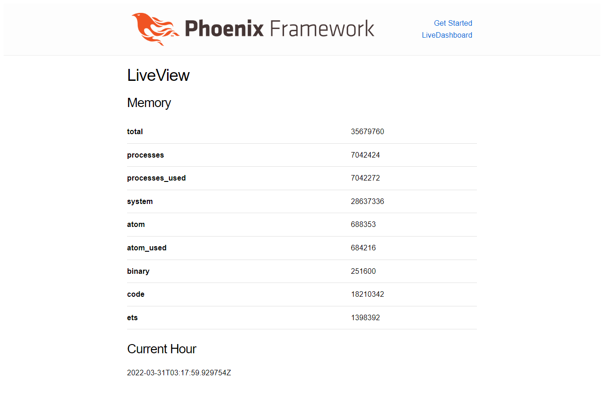

# Hangman

This repository is the code corresponding to the [Elixir for Programmers, Second Edition](https://codestool.coding-gnome.com/courses/elixir-for-programmers-2) lab by [Dave Thomas](https://twitter.com/pragdave).

> There are many components in this repository, all of than focus to build a Hangman Game.

## Structure

## Components

### Dictionary

> This backend component reads a random word for the Hangman Game.

[:link: More details](dictionary/README.md)

### Hangman

> This backend component has the logic engine for the Hangman Game.

[:link: More details](hangman/README.md)

### Text Client

> This frontend project builds Hangman UI using Command Lines.

[:link: More details](text_client/README.md)

### B1

> This frontend project builds Hangman UI using HTML pages.

[:link: More details](b1/README.md)

### Memory

> This project is to get to know the Phoenix LiveView.

[:link: More details](memory/README.md)

### B2

> This frontend project builds Hangman UI using LiveView.

[:link: More details](b2/README.md)
